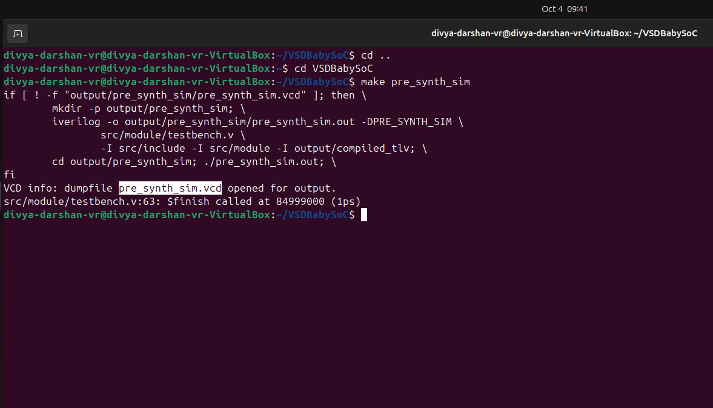
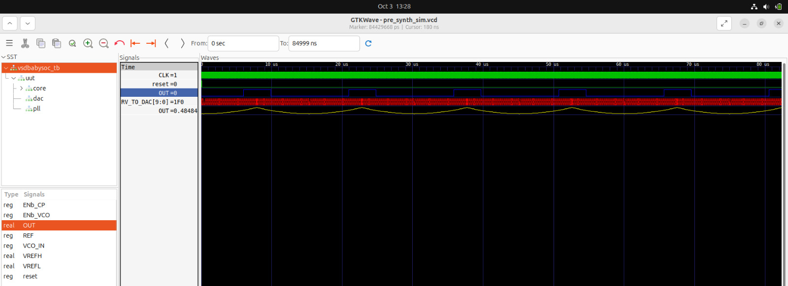
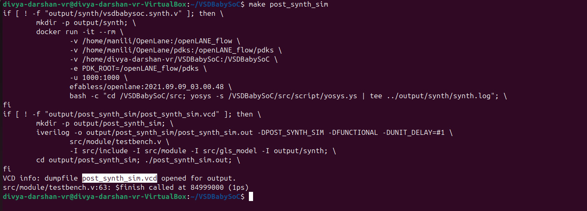
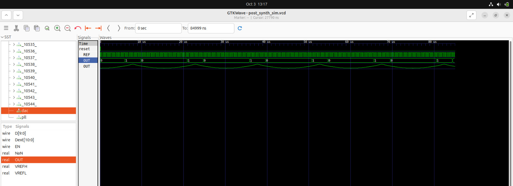
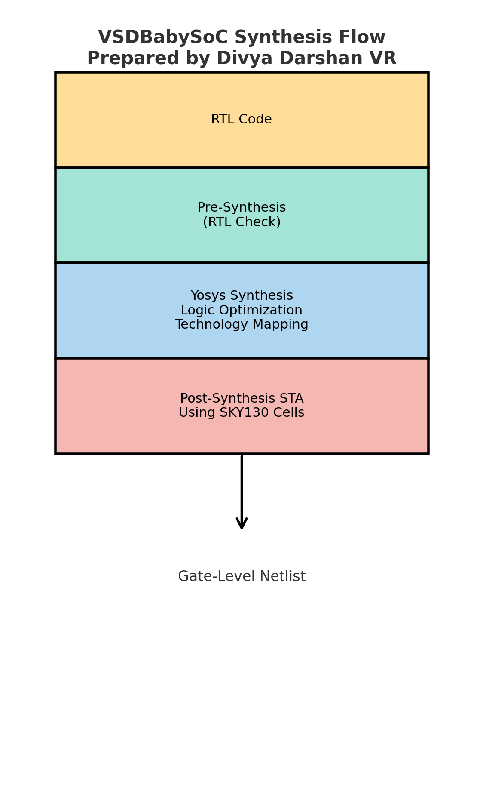
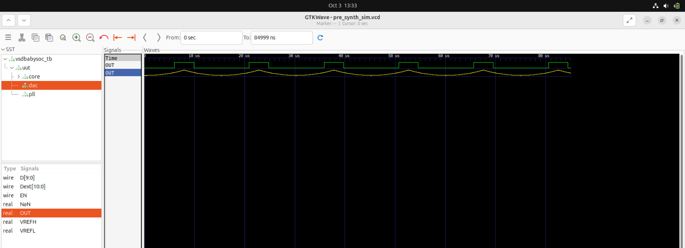
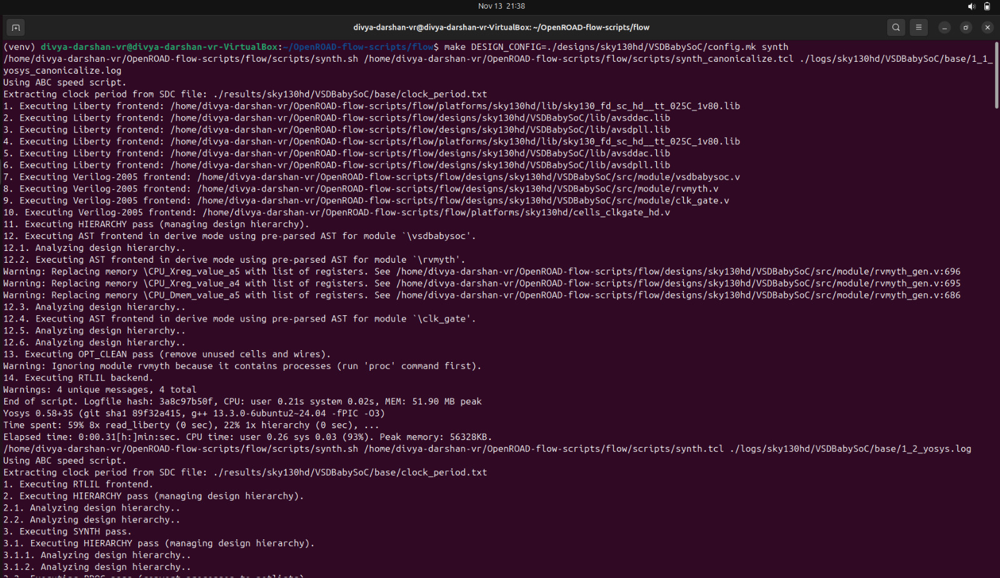
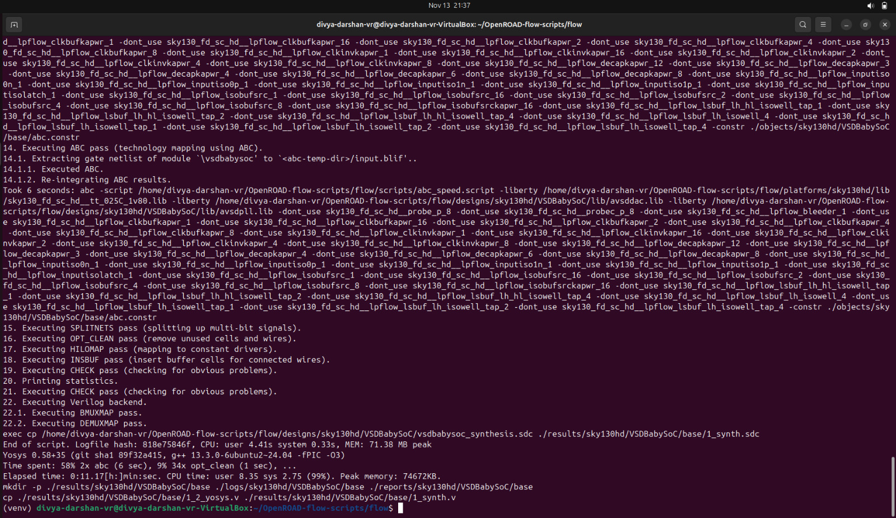

# RTL Synthesis — VSDBabySoC
---
## Overview
The synthesis stage converts the RTL Verilog design of the VSD Baby SoC into a gate-level netlist using the Sky130 standard cell library. Both Pre-Synthesis and Post-Synthesis analyses were performed to validate correctness and timing before entering physical design.

Synthesis Overview

- The synthesis for the VSDBabySoC was carried out in two stages:
    - Logic Synthesis using Yosys
    - Physical-Aware Optimization using OpenROAD

This ensures that the gate-level netlist is first generated from RTL (Yosys), and then further optimized considering timing and physical constraints (OpenROAD).

---
**Tools Used**
```
1. Yosys – Open-source synthesis suite
2. ABC – Backend technology mapper
3. SkyWater SKY130 PDK .lib files
```
---
### What is Pre-Synthesis?

- Pre-synthesis analysis is performed at the RTL level before mapping to standard cells.

**Characteristics**

- No real cell delays
- Ideal wire and logic assumption
- Determines logic depth and behavior
- Helps identify:
    - Missing resets
    - Latches
    - Unconnected signals
    - Combinational loops

**Outputs**

- Functional correctness at RTL
- Initial timing estimation (ideal)

---
### What is Post-Synthesis?

- Post-synthesis analysis is performed after RTL is converted to real gates from the Sky130 standard cell library.

**Characteristics**

- Real gate delays from .lib models
- Wire delays still ideal
- Provides realistic:
    - Slack
    - Critical path
    - Area breakdown

**Purpose**
- Ensures the design can theoretically run at the target frequency before place & route.
---
### Project Directory
```
VSDBabySoC/
├── src/
│   ├── include/
│   │   ├── sandpiper.vh
│   │   └── other header files...
│   ├── module/
│   │   ├── vsdbabysoc.v      # Top-level module integrating all components
│   │   ├── rvmyth.v          # RISC-V core module
│   │   ├── avsdpll.v         # PLL module
│   │   ├── avsddac.v         # DAC module
│   │   └── testbench.v       # Testbench for simulation
└── output/
└── compiled_tlv/         # Holds compiled intermediate files if needed
```
---
## Steps to do Synthesis

**1. Pre-Synthesis**

1. First we need to install some important packages:
```bash
$ sudo apt install make python python3 python3-pip git iverilog gtkwave docker.io
$ sudo chmod 666 /var/run/docker.sock
$ cd ~
$ pip3 install pyyaml click sandpiper-saas
```

2. Now we can clone this repository in an arbitrary directory (we'll choose home directory here):
```bash
$ cd ~
$ git clone https://github.com/manili/VSDBabySoC.git
```
3. It's time to make the `pre_synth_sim.vcd`:
```bash
$ cd VSDBabySoC
$ make pre_synth_sim
```
- The result of the simulation (i.e. pre_synth_sim.vcd) will be stored in the output/pre_synth_sim directory.

**2. Post_synth_sim.vcd:**
```bash
$ cd VSDBabySoC
$ make post_synth_sim
```
- The result of the simulation (i.e. post_synth_sim.vcd) will be stored in the output/post_synth_sim directory.

- We can see the waveforms by following command:

`For pre simulation wave`:
```bash
$ gtkwave output/pre_synth_sim/pre_synth_sim.vcd
```
`For Post simulation wave`:
```bash
$ gtkwave output/post_synth_sim/post_synth_sim.vcd
```
- Two most important signals are `CLK` and `OUT`. The `CLK` signal is provided by the PLL and the `OUT` is the output of the DAC model.
---

**Pre-Synthesis simulation log screenshot:**



---
**Pre-Synthesis gtkwave Screenshot:**



---
### My Observations from VSDBabySoC Simulation (Pre-Synthesis)

| Signal                  | Source                     | Observation                                                                                   |
|-------------------------|----------------------------|-----------------------------------------------------------------------------------------------|
| **CLK**                 | PLL                        | Stable and synchronized. Ensures correct execution of RVMYTH instructions.                  |
| **reset**               | External input             | Initializes the CPU correctly. All registers, including `r17`, start from a known state.    |
| **OUT (VSDBabySoC)**    | DAC                        | Appears as a digital signal in simulation due to Icarus Verilog limitations.                |
| **RV_TO_DAC[9:0]**      | Register `r17` (RVMYTH)  | Updates sequentially with instruction execution. This is the data sent to the DAC.          |
| **OUT (DAC, real type)** | DAC                        | Shows accurate analog waveform. This is the signal to observe for real analog output.        |

---

### Post Synthesis simulation

**Post-Synthesis simulation log screenshot:**



---

**Pre-Synthesis gtkwave Screenshot:**



- The post synthesis simulation matches the pre synthesis simulation perfectly.
- Thus the synthesis of `VSDBabySoC` is passed without any errors.

---
### Synthesis Flowchart



**Important Note:**
  
Real variables are not supported during synthesis, so `VSDBabySoC.OUT` must be a `wire`, which behaves digitally in simulation. To observe analog behavior, we need to use `DAC.OUT`.



- The above picture proves that the `VSDBabySoC.OUT` shows digital behaviour (which is `1's` and `0's`), whereas `DAC.OUT` shows analog behaviour but if we carefully note it , the continuous signal is made up of small rise and fall steps which together seen as a continuous signal.

---
```
#----------------------------------------------
#                    NOTE
#----------------------------------------------
- In Week-2, logic synthesis was carried out using Yosys to generate the initial gate-level netlist and validate functional correctness and base timing.

- In Week-8, when the backend flow began in OpenROAD, a second synthesis was required. This synthesis incorporated physical design information such as estimated wire delays and placement constraints, making it a physical-aware synthesis run.

- Running synthesis twice is standard practice in industry when shifting from pure front-end RTL development to physical implementation and helps achieve better timing closure during placement and routing.
```
---
## OpenROAD Based Synthesis:

## Commands Used

```bash
# Move to this directory
cd ~/OpenROAD-flow-scripts/flow

# Run this Command
make DESIGN_CONFIG=./designs/sky130hd/VSDBabySoC/config.mk synth
```
- The above command will run upto Synthesis and ABC mapping.
---
## Terminal Screenshot





---
## Synthesis Summary (vsdbabysoc)

| Metric                                   | Value                      | Notes / Source |
|------------------------------------------|-----------------------------|----------------|
| **Total Cell Count**                     | 5913 cells                  | Technology-mapped netlist |
| **Total Sequential Cells**               | 1144 cells                  | `sky130_fd_sc_hd__dfxtp_1` flops |
| **Total Combinational Cells**            | 4769 cells                  | 5913 − 1144 |
| **Total Reported Chip Area**             | 52,874.4608 µm²             | From synthesis report |
| **Sequential Cell Area**                 | 22,901.9648 µm²             | Provided by tool |
| **Sequential Area (%)**                  | 43.31%                      | Sequential area ÷ total area |
| **Memory Blocks**                        | 0                           | No memories inferred |
| **Custom Macros Used**                   | 2 (`avsddac`, `avsdpll`)    | 1 instance each |
| **Unknown Macro Area Warning**           | Yes                         | `Area for avsddac / avsdpll is unknown` |
| **Largest Cell Categories**              | NAND2, O21AI, A21OI, FFs    | High count cells indicate logic style |
| **Design Hierarchy Depth**               | vsdbabysoc → rvmyth → clk_gate | From hierarchy report |

---
## Insights from the Synthesis Report

| **Aspect** | **Insight Gained** | **Importance** |
|-----------|---------------------|----------------|
| **Design Hierarchy** | Shows structure: `vsdbabysoc → rvmyth → clk_gate` | Confirms correct RTL integration and module connections |
| **Cell Count Breakdown** | Total cells = 5913; Sequential = 1144; Combinational = 4769 | Essential for estimating area, timing, and power |
| **Flip-Flop Usage** | 1144 DFFs inferred | Indicates register usage, pipeline depth, and sequential load |
| **Combinational Logic Density** | ~4769 logic cells (NAND, NOR, AOI, OAI, MUX, etc.) | Impacts timing closure and routing congestion |
| **Custom Macro Presence** | `avsddac` and `avsdpll` each appear once | Must provide LEF/LIB/GDS for clean physical design |
| **Macro Area Unknown Warning** | Tool reports area not defined for macros | Needs fixing for accurate floorplan and utilization |
| **Total Area Reported** | 52,874.4608 µm² | Helps set die/core size during floorplanning |
| **Sequential Area Contribution** | 43.31% of total area (22,901 µm²) | Valuable for power estimation and clock tree planning |
| **Standard Cell Variety** | High count of NAND, OAI, AOI, etc. | Reveals logic style and influences timing paths |
| **Clock-related Cells** | 568 `clkinv` cells inferred | Determines clock tree load and CTS complexity |
| **Memory Inference Check** | No memories inferred | Ensures RTL didn’t unintentionally create latches or RAM |
| **Wire & Port Count** | Thousands of wires and bits; 7 ports | Indicates netlist complexity and routing demand |
| **Technology Mapping Quality** | `$AND`, `$MUX`, `$OR` → mapped to sky130 standard cells | Ensures correct synthesis for the target PDK |

---
## Conclusion

- The synthesis stage successfully converted the RTL into a gate-level netlist using Sky130 cells, confirming logical correctness.
- Key metrics such as cell count, area, and utilization were analyzed to ensure the design fits within technology constraints.
- This stage provides a validated structural blueprint for the physical design flow, enabling smooth progression to floorplanning.
---

**Synthesis completed successfully with valid timing and acceptable area utilization, making the design ready for physical floorplanning.**