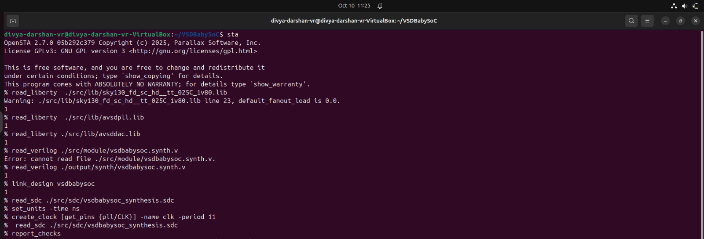
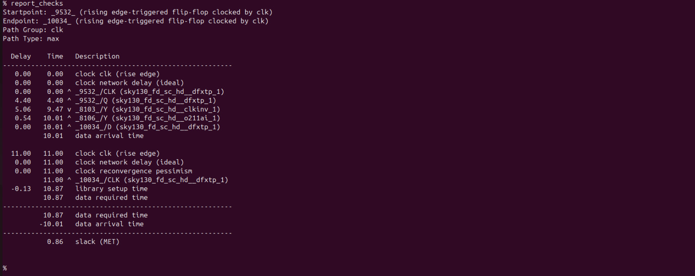
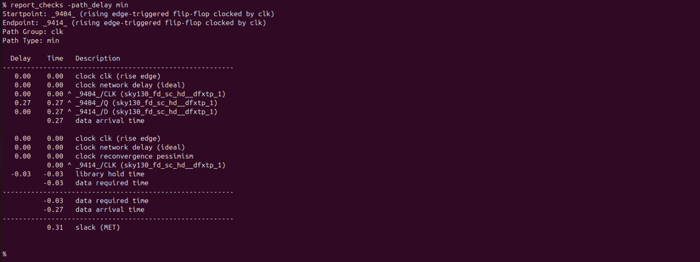

# Pre-Route STA - VSDBabySoC
---
## Objective 

The objective of Pre-Route Static Timing Analysis (STA) is to evaluate the timing performance of the synthesized design before physical routing is performed, using estimated interconnect delays. This early analysis identifies potential setup and hold violations in the gate-level netlist, ensuring that the logic implementation is timing-clean before moving into physical design stages such as floorplanning and placement.

---
## What Pre-Route STA Ensures

- Logic paths meet required timing without real routing parasitics
- The design is functionally and structurally valid at the netlist level
- Early timing violations are detected and fixed before physical implementation
- Optimization decisions (retiming, resizing, buffering) can be made early
- Prevents unnecessary iterations later in the flow

In simple,
```
Pre-Route STA provides an early timing validation of the synthesized netlist using estimated delays to confirm readiness for physical design.
```
---
## Steps to do Pre Route STA for VSDBabySoC

```bash
cd Desktop/SoC/VSDBabySoC
sta

# Load Liberty Libraries (standard cell + IPs)
read_liberty  ./src/lib/sky130_fd_sc_hd__tt_025C_1v80.lib
read_liberty  ./src/lib/avsdpll.lib
read_liberty ./src/lib/avsddac.lib

# Read Synthesized Netlist
read_verilog ./src/module/vsdbabysoc.synth.v

# Link the Top-Level Design
link_design vsdbabysoc

# Apply SDC Constraints
read_sdc ./src/sdc/vsdbabysoc_synthesis.sdc
 
#SDC Constraints
set_units -time ns
create_clock [get_pins {pll/CLK}] -name clk -period 11

# Generate Timing Report (by default max path)
report_checks

# Generate Timing Report for min path
report_checks -path_delay min
```
**Screenshot**: Terminal Output
 


---
**Screenshot**: VSDBabySoC Timing report for max path
 


---
**Screenshot**: VSDBabySoC Timing report for min path
 


---
## Conclusion
The Pre-Route Static Timing Analysis results show that the design meets the required setup and hold timing constraints at the logical netlist level using estimated interconnect delays. No critical timing violations were observed, and the slack values remained within acceptable limits.

---

**Pre-Route STA was performed on the synthesized netlist using estimated interconnect delays, and the timing results showed positive slack with no critical violations. This confirms that the design meets timing at the logical level and is fully qualified to proceed into floorplanning and physical implementation.**