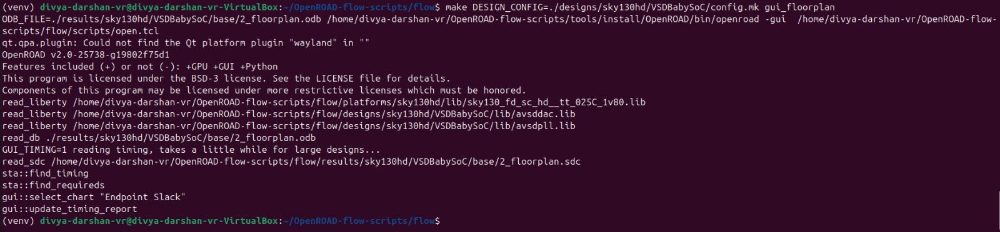
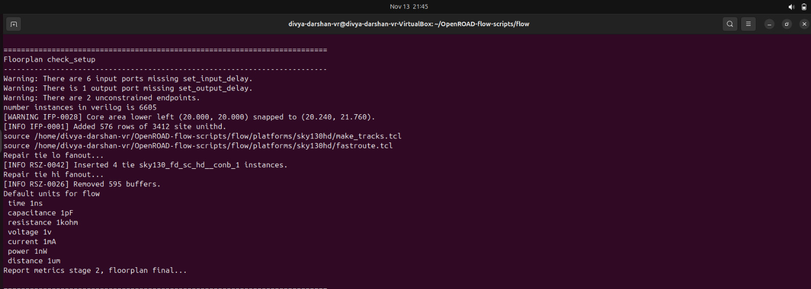
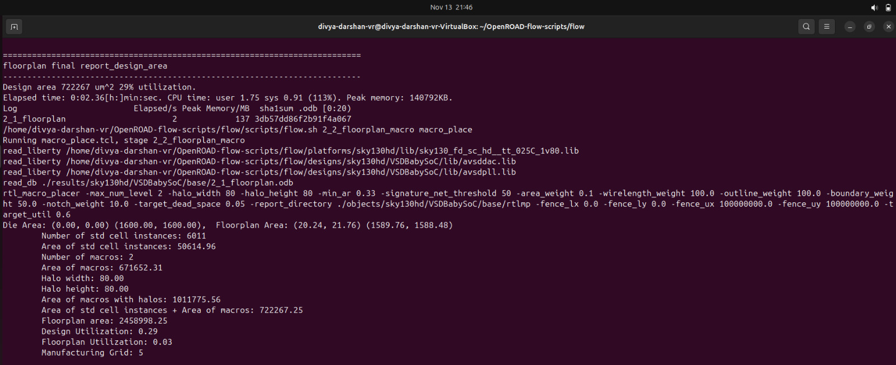
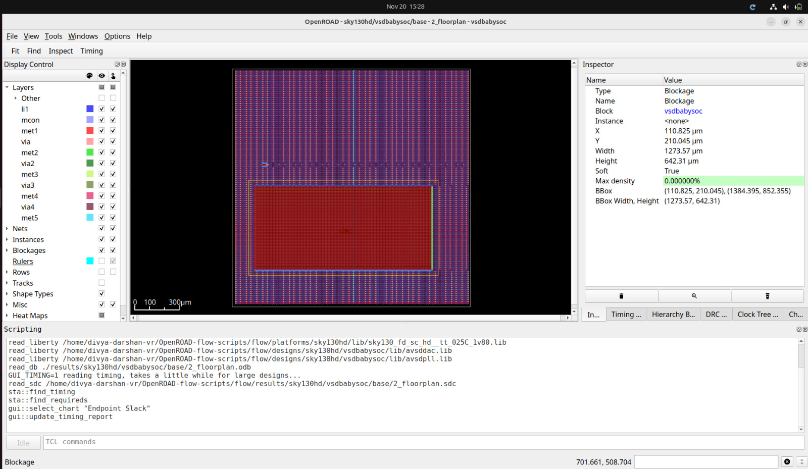
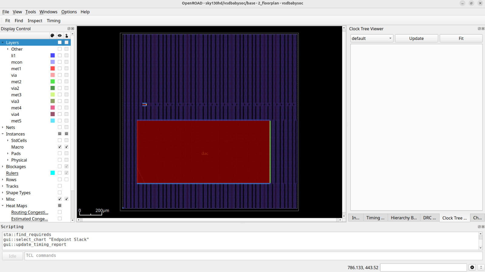
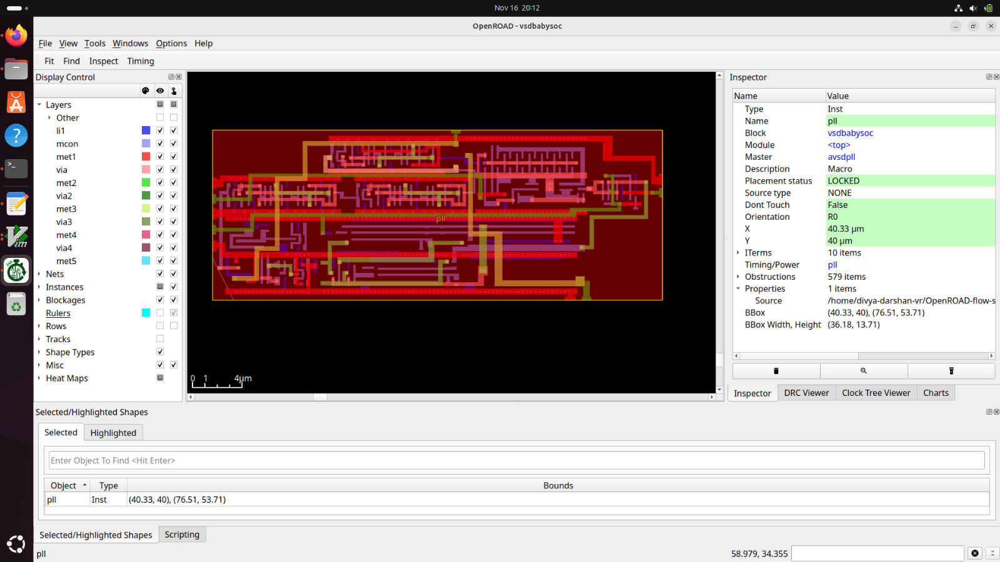

# Floorplanning — VSDBabySoC
---
## Objective

- Floorplanning defines the physical layout of the chip, determining:
    - Core area (where standard cells are placed) 
    - Placement of IO pins
    - Utilization factor (how densely the core is packed)
    - Power distribution planning reference
    - Block/pad arrangement
    - Routing resources & congestion targets

- A good floorplan ensures:
    - Lower congestion
    - Shorter wire lengths
    - Better timing closure
    - Cleaner power distribution

---
## Commands Used
```bash
make DESIGN_CONFIG=./designs/sky130hd/VSDBabySoC/config.mk floorplan
```
- This will run only the floorplan steps and process.
---
## Terminal Screenshot:



---

**1. Floorplan Setup Check**

- The Floorplan Setup Check is performed before the actual floorplan stage begins to ensure all inputs and constraints are valid.

**Key Points**

**a. Validity Check of Inputs:**
- Confirms that design files, LEFs, tech files, die/core dimensions, utilization, and pin constraints are correctly defined before executing the floorplan.

**b. Error Prevention:**
- Detects issues such as missing pins, incorrect floorplan parameters, or absent power nets, preventing failures later in the implementation flow.



---
**2. Floorplan Final Report (report_design)**

- The Final Report Design is generated after floorplan completion to provide the finalized statistics of the layout.

**Key Points**

**a. Post-Floorplan Summary:**
- Shows updated design information such as area, core size, utilization, macro locations, and pin distributions after tapcells, endcaps, and power grid insertion.

**b. Verification of Floorplan Output:**
- Helps validate that the floorplan is correctly generated and ready for downstream stages like placement, routing, and timing analysis.



---

**Note**
Macros are floorplanned separately because EDA tools can automatically plan only standard-cell logic; hard macros are black-box structures with fixed size and pin layout, requiring explicit manual or guided placement.

**Placement of Macros**

```bash
pll 200 950 N
dac 150 250 N
```

- This will place the `Dac` macro in the top right and `pll` in the bottom left which is sourced in the config file.
---
## Floorplan View



---
## Macro Floorplan View without nets and rails



---



---

**Observation**

- The floorplan layout view shows the overall physical structure of the chip at an early stage of physical design.
- Displays the positions of macros, and IO pads, ensuring minimum spacing, alignment, and routing allowances.
- The layout shows the power rings, stripes, and rails created during floorplanning.
- Provides a view of utilization %, whitespace, and routing channels, particularly near macros.

---
## Floorplan Timing and Power Summary

- **TNS = 0.00** → No setup violations.
- **WNS = 0.00** → All paths meet setup timing.
- **Worst Slack = +0.27 ns** → Design has timing margin.
- **Clock Min Period = 10.73 ns** → Maximum achievable frequency ≈ 93 MHz.
- **Hold Timing Slack = MET** → No hold violations.
- **Setup Timing Slack = MET** → Critical paths meet timing.
- **Power Breakdown**
  - Sequential cells: 75.7%
  - Combinational cells: 24.3%
  - Total Power ≈ **6.22 mW**
---

**The floorplan results show that the design meets all setup and hold timing requirements with positive slack and acceptable early-stage power. Therefore, the design is ready for placement.**