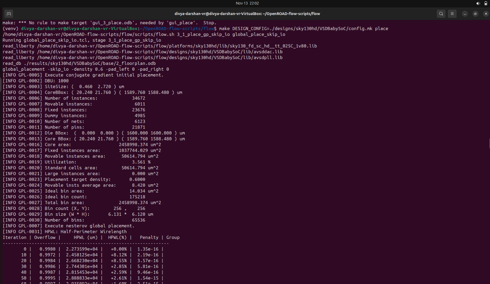
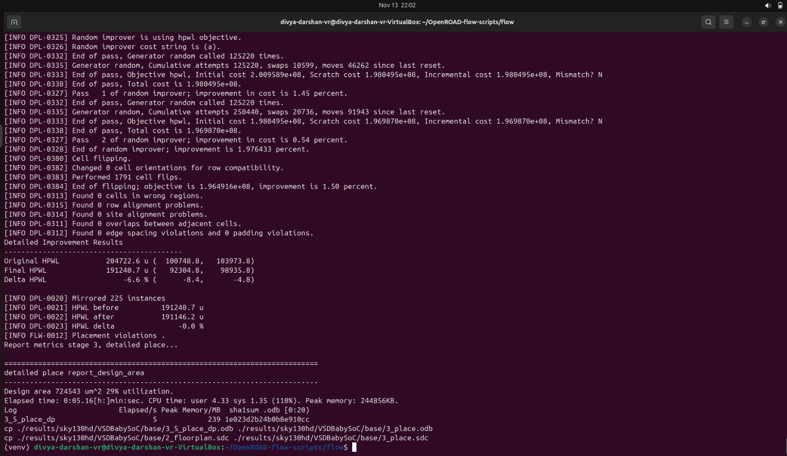
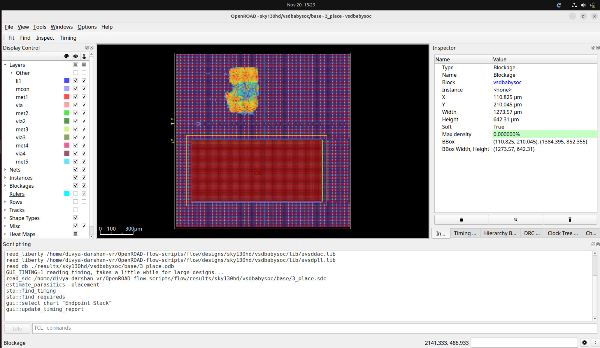

# Placement — VSDBabySoC
---
## Objective
- The objective of Placement is to position all standard cells within the defined core area in an optimized manner such that:

    - Wirelength is minimized
    - Routing congestion is reduced
    - Timing paths are improved

- Power and area utilization remain within acceptable limits
- Placement ensures that the design is physically arranged in a way that supports efficient clock distribution, easier routing, and strong timing closure in the later stages of the physical design flow.

## Commands Used

```bash
make DESIGN_CONFIG=./designs/sky130hd/VSDBabySoC/config.mk place
```
- This will do both detailed and global placement by default.
---
## Terminal Screenshot






---
## Placement View



**Observation**

- The placement view clearly shows all standard cells arranged in legal rows with no overlaps, indicating successful global and detailed placement.
- Macros remain fixed at their predefined locations, while standard cells are optimally clustered around them, ensuring balanced density and reduced routing congestion.

---

## Placement Timing and Power Summary

- **TNS = 0.00** → No setup timing violations after placement.
- **WNS = 0.00** → All critical paths close timing successfully.
- **Worst Slack = +0.33 ns** → Placement improved timing margin.
- **Clock Min Period = 10.08 ns** → Maximum achievable frequency ≈ 99 MHz.
- **Hold Slack = MET** → No hold-time violations observed.
- **Setup Slack = MET** → All setup constraints remain satisfied post-placement.
- **Power Breakdown**
    - Sequential Cells: 73.5%
    - Combinational Cells: 26.5%
    - Total Power ≈ **6.45 mW**

---

**The placement results confirm timing closure with improved slack and stable power characteristics. Cell legalization and optimization are successful, and the design is ready to proceed to clock tree synthesis.**