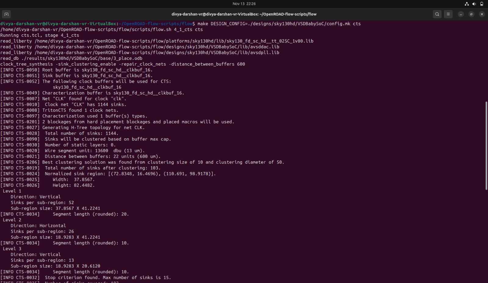
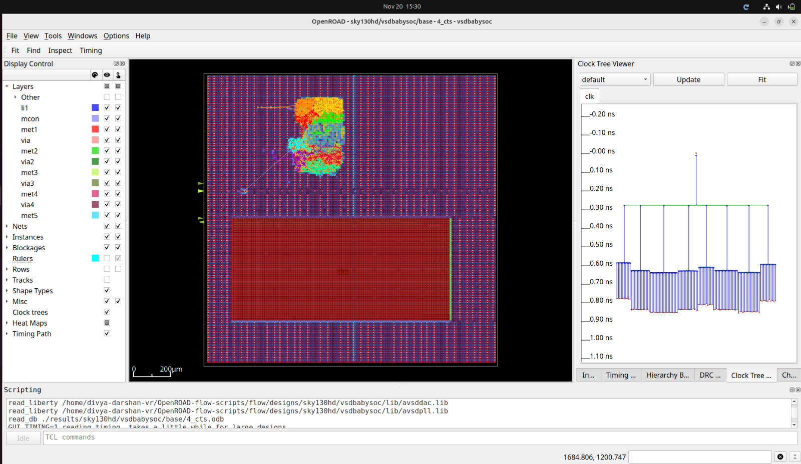

# CTS — VSDBabySoC
---
## Objective

- The objective of Clock Tree Synthesis (CTS) is to insert and optimize clock buffers and inverters to distribute the clock signal uniformly across the chip so that:

    - Clock skew between sequential elements is minimized
    - Clock insertion delay is controlled and within limits
    - Sequential elements receive a stable and synchronized clock
    - The design achieves reliable timing closure after CTS

- CTS ensures that the clock network is balanced and capable of driving all flip-flops and sequential elements efficiently, preparing the design for post-CTS timing analysis and routing.
---

## Commands Used

```bash
make DESIGN_CONFIG=./designs/sky130hd/VSDBabySoC/config.mk cts
```
- This will do both detailed and global placement by default.
---
## Terminal Screenshot



---
## CTS View



**Observation**
- The CTS view shows clock buffers distributed across the design, forming a balanced tree that drives all sequential elements with minimal skew.
- The clock network appears well-structured, with buffers inserted near high-fanout regions and evenly along long clock paths, ensuring stable clock propagation and improved timing closure.

---
## CTS Timing and Power Summary

- **TNS = 0.00** → No setup timing violations after CTS.  
- **WNS = 0.00** → All timing paths meet constraints successfully.  
- **Worst Slack = +5.93 ns** → Clock tree insertion improved timing significantly.  
- **Clock Min Period = 5.07 ns** → Maximum achievable frequency ≈ **197 MHz**.  
- **Hold Slack = MET** → No hold-time issues; CTS balanced the tree well.  
- **Setup Slack = MET** → All setup paths remain clean after clock buffering.  
- **Clock Skew ≈ −0.24 ns** → Very small skew, showing good CTS balancing.  
- **Power Breakdown**
  - Clock Network Power: **Increases due to buffer insertion**
  - Sequential Cells: **Higher switching activity from the clock tree**
  - Total Power: **Slightly higher than placement stage**

---

**The CTS results show a well-balanced clock tree with zero violations, positive timing margin, low skew, and stable power behavior. The design is now ready for routing.**

