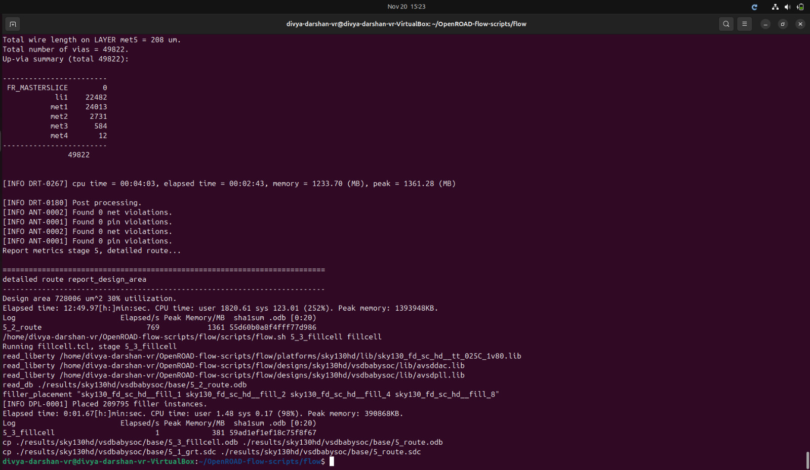
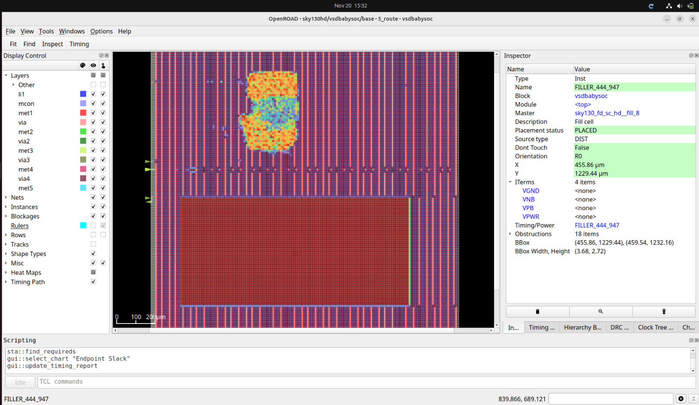
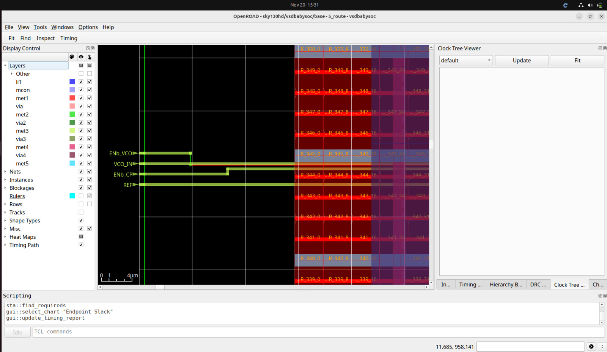
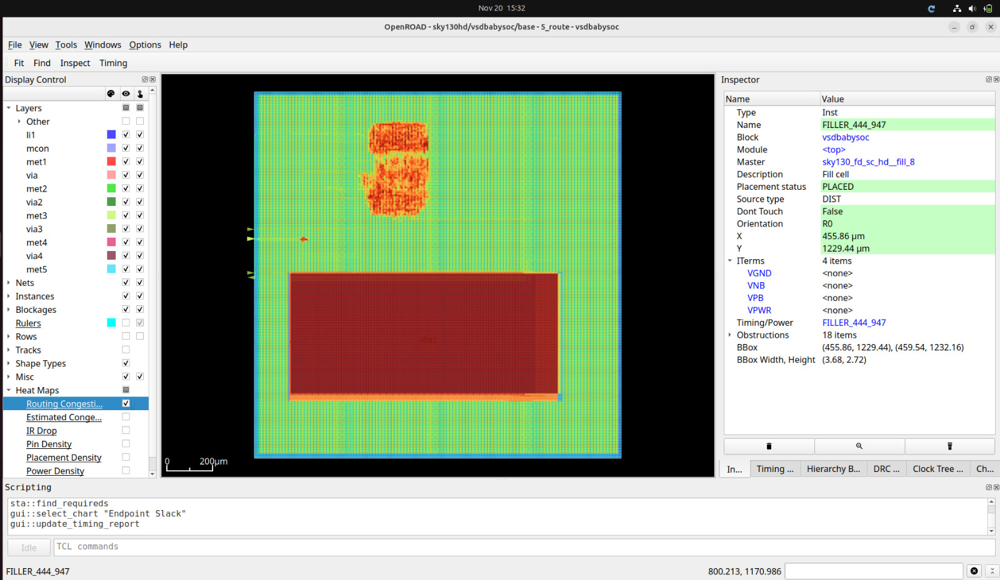

# Routing — VSDBabySoC
---

## Objective
The objective of **Routing** is to physically connect all the placed standard cells and macros using metal interconnect layers in a DRC-compliant manner. Routing aims to:

- Complete all net connections  
- Minimize congestion  
- Meet timing constraints after RC parasitics  
- Satisfy design rules defined by the technology

Routing is performed in two stages:

- **Global Routing** – Generates routing paths and resource estimates  
- **Detailed Routing** – Creates final metal shapes and vias

## Commands Used

```bash
make DESIGN_CONFIG=./designs/sky130hd/VSDBabySoC/config.mk route
```
- This will do both detailed and global route by default.
---
## Terminal Screenshot



---
## Routed View



---
**Screenshot**: Routed Pins view



---
**Screenshot**: Routing Congestion View



---

**Routing was completed successfully with clean interconnections, acceptable congestion, and adherence to design rules. The design is now ready for SPEF extraction and post-route STA.**