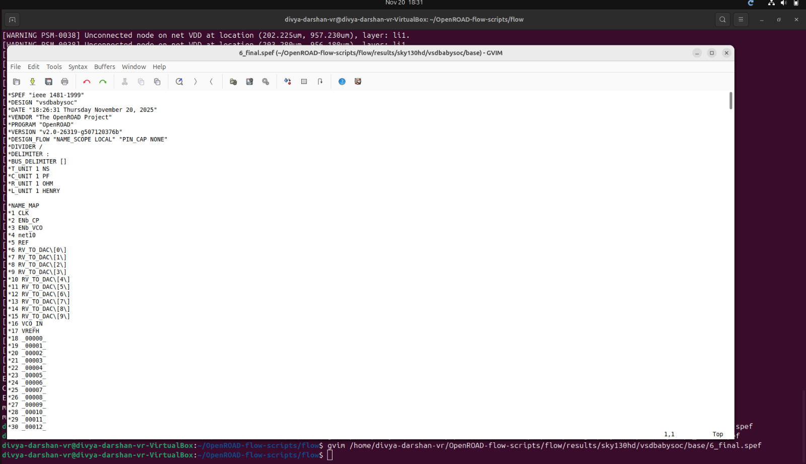
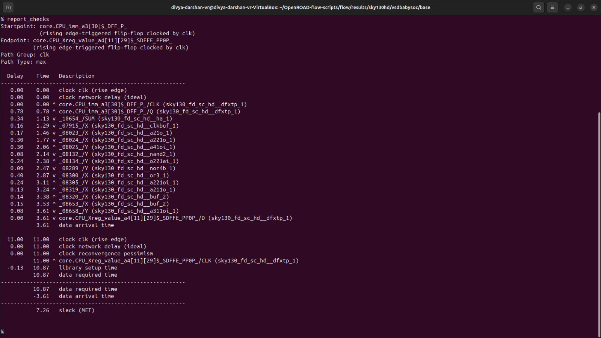
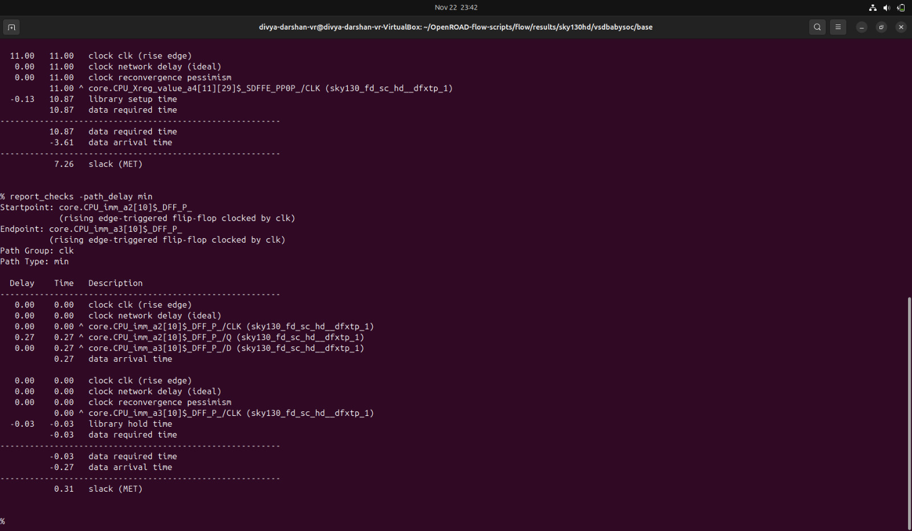

# SPEF-Based Timing Analysis - VSDBabySoC
---
**Definition:**
- SPEF is a standardized textual file format that provides detailed parasitic information (resistance, capacitance, and sometimes inductance) of a chip’s routing interconnects, which is used for accurate post-layout timing analysis (STA).

**Key Points:**

- Captures RC parasitics of nets after placement and routing.
- Used by Static Timing Analysis (STA) tools to compute delay, slew, and crosstalk effects.
- Ensures timing closure by reflecting realistic interconnect delays.
- Comes in two main types:
    - Unit SPEF: resistances in ohms, capacitances in farads.
    - Scaled SPEF: values scaled by a factor for readability.

**Summary:**
SPEF bridges the gap between layout parasitics and accurate timing analysis.

---
## Steps to generate SPEF file

1. **Load design and technology files**
```bash
cd ~/home/divya-darshan-vr/OpenROAD-flow-scripts/flow/designs/sky130hd/vsdbabysoc/lef
read_lef sky130hd.lef
read_lef avsdpll.lef
read_lef avsddac.lef
read_liberty sky130_fd_sc_hd__tt_025C_1v80.lib
read_def 5_2_route.def
```

2. **Define process corner & extract parasitics**
```bash
define_process_corner -ext_model_index 0 rules.openrcx.sky130A.nom.calibre
extract_parasitics -ext_model_file rules.openrcx.sky130A.nom.calibre
```

3. **Write SPEF**
```bash
write_spef vsdbabysoc.spef
```

4. **Write post-route Verilog netlist**
```bash
write_verilog vsdbabysoc_post_place.v
```

✅ SPEF captures actual wire RC, and the post-placement Verilog ensures netlist matches routed layout.

---
## vsdbabysoc.spef file Screenshot



- It contains the parasitic information (resistance, capacitance, and sometimes inductance) of the design (Here it is VSDBabySoC).

---
## Steps to do Timing Analysis Without SPEF
`(Used to compare with post-route STA)`

```bash
# Change to the directory containing the files
cd ~/OpenROAD-flow-scripts/flow/results/sky130hd/vsdbabysoc/base

# Invoke the OpenSTA tool
sta

# Load the standard cell timing library (Liberty format)
read_liberty /home/divya-darshan-vr/OpenSTA/examples/timing_libs/sky130_fd_sc_hd__tt_025C_1v80.lib
read_liberty /home/divya-darshan-vr/OpenSTA/examples/timing_libs/avsddac.lib
read_liberty /home/divya-darshan-vr/OpenSTA/examples/timing_libs/avsdpll.lib

# Load the post routed Verilog netlist for analysis (Kindly enter the file name as it is in your device)
read_verilog 1_synth.v

# Link the top-level module in the Verilog netlist with the loaded timing library
% link_design vsdbabysoc

# Load the constraint file (Kindly enter the file name as it is in your device)
% read_sdc 1_synth.sdc

# Generate timing report for max check
report_checks

# Generate timing report for min check
report_checks -path_delay min
```
## Report of STA Without SPEF 

**Screenshot:** Max path Check



**Screenshot:** Min path Check



---

**SPEF extraction was completed successfully, capturing realistic wire parasitics. The design now reflects accurate interconnect delays and is ready for post-route STA to verify timing closure.**