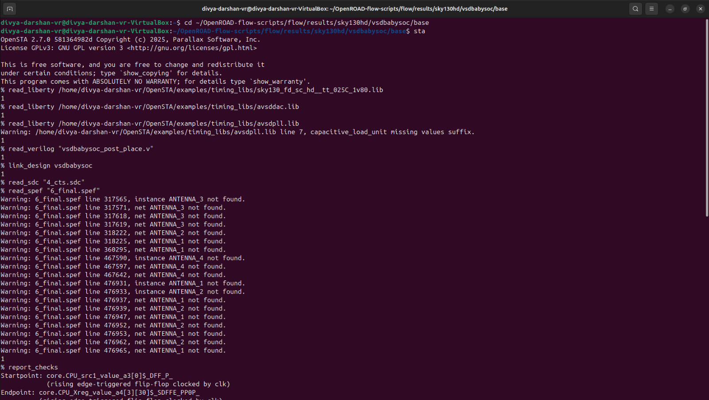
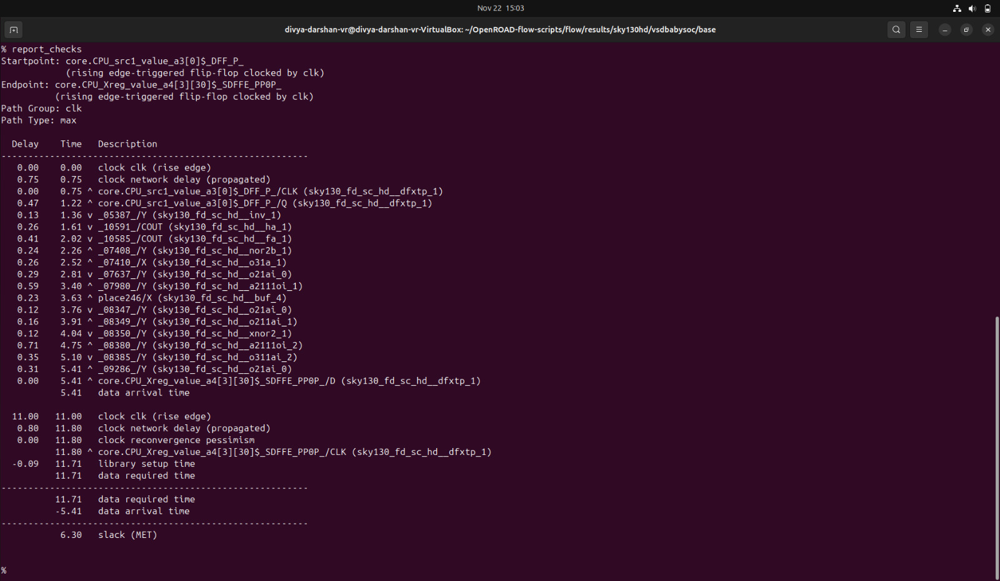
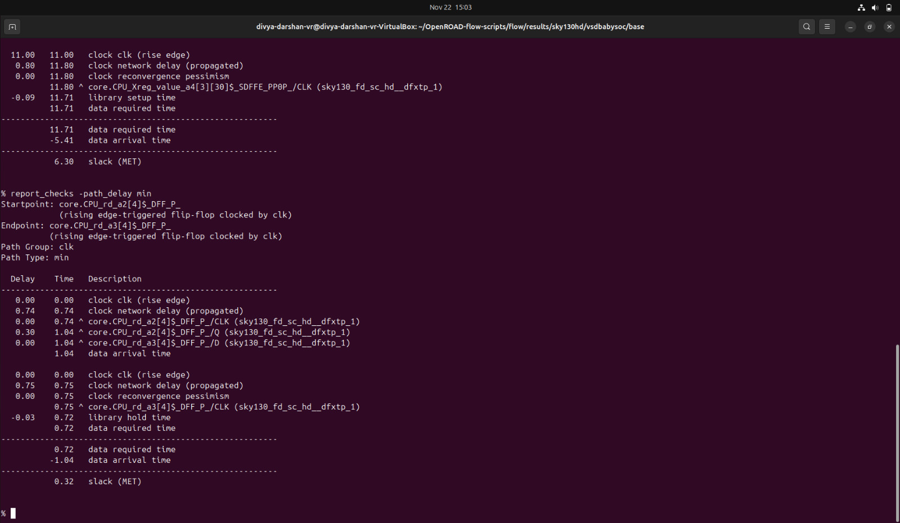
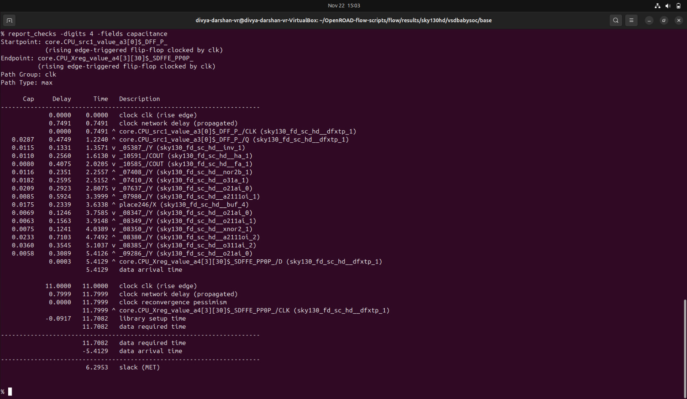
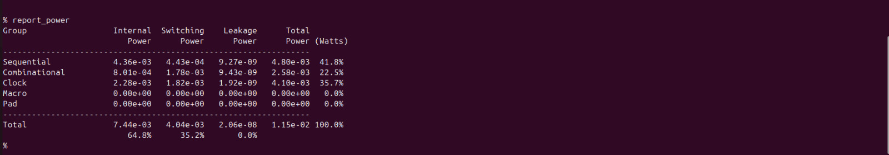
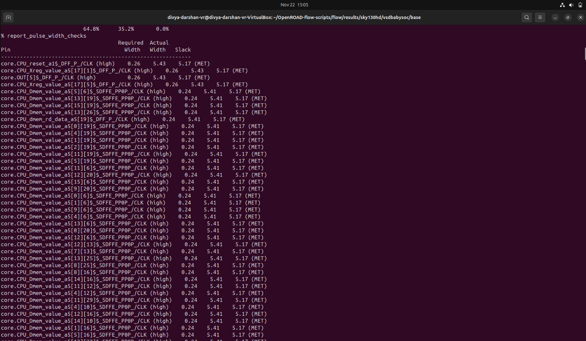
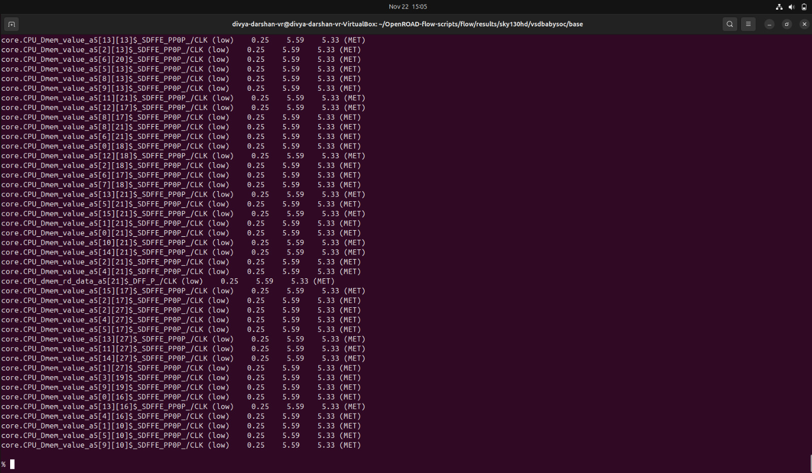
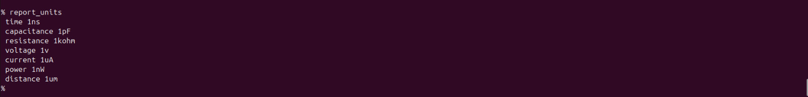
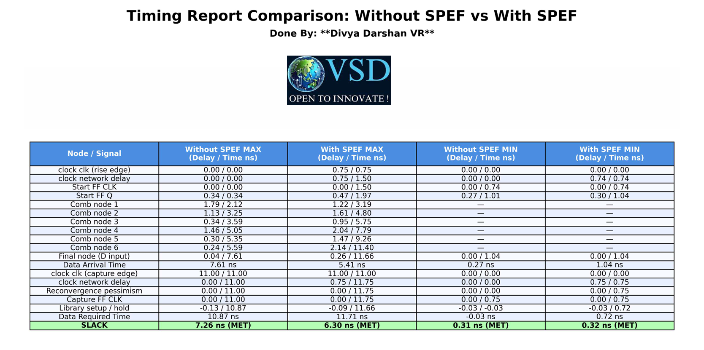
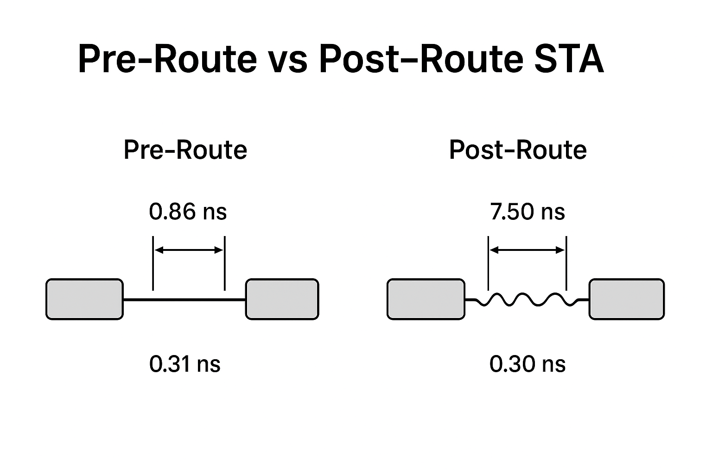

# Post-Route STA - VSDBabySoC
---
## Objective 

The objective of Post-Route Static Timing Analysis (STA) is to evaluate the timing performance of the fully routed design, using accurate interconnect delays extracted from the routed layout. This analysis ensures that all setup and hold timing requirements are met, accounting for actual wire RC parasitics, clock tree delays, and routing effects, providing a realistic view of the design's timing behavior.

---
## What Post-Route STA Ensures

- All timing paths meet required setup and hold constraints with real routing delays
- Accurate verification of critical paths using SPEF-extracted parasitics
- Detection of hold or setup violations introduced by routing and CTS
- Validation of clock tree skew and jitter across all corners
- Confirms that the design is timing-closed and ready for sign-off

In simple,
```
Post-Route STA validates the timing of the fully routed design using accurate interconnect delays, ensuring timing closure and readiness for final sign-off.
```
---
## Steps to do Post-Route Timing Analysis `(Includes spef file)`

```bash
# Change to the directory containing the files
cd ~/OpenROAD-flow-scripts/flow/results/sky130hd/vsdbabysoc/base

# Invoke the OpenSTA tool
sta

# Load the standard cell timing library (Liberty format)
read_liberty /home/divya-darshan-vr/OpenSTA/examples/timing_libs/sky130_fd_sc_hd__tt_025C_1v80.lib
read_liberty /home/divya-darshan-vr/OpenSTA/examples/timing_libs/avsddac.lib
read_liberty /home/divya-darshan-vr/OpenSTA/examples/timing_libs/avsdpll.lib

# Load the post routed Verilog netlist for analysis
read_verilog vsdbabysoc_post_place.v

# Link the top-level module in the Verilog netlist with the loaded timing library
% link_design vsdbabysoc

# Load the constraint file
% read_sdc 4_cts.sdc

# Load the parasitic SPEF file for accurate delay calculation
% read_spef 6_final.spef

# Generate timing report for max check
report_checks

# Generate timing report for min check
report_checks -path_delay min
```
---

**Screenshot:** Terminal output



---
**Screenshot:** SPEF Based Max path Check



---
**Screenshot:** SPEF Based Min path Check



---
### Capacitance Analysis
- Generate a report of parasitic or electrical checks with a focus on capacitances.

**Command:**
```bash
report_checks -digits 4 -fields capacitance
```


---
## Power Report Analysis
- Generates a **power analysis report** for your design.
- Computes **dynamic, static, and total power** for the circuit.

**Command:**
```bash
report_power
```


---

## Pulse Width Checks

- Checks the **pulse width of signals** in your design.
- Ensures that **short glitches or narrow pulses** do not violate timing constraints.
- Important for **setup/hold integrity** and **avoiding false switching**.

**Command:**
```bash
report_pulse_width_checks
```




---
## Report Units
- Displays the **units of measurement** currently used in the STA tool.

**Command:**
```bash
report_units
```


---
## Timing Report Comparison: Without SPEF vs With SPEF



---
**Screenshot:** Shows the effect of `Pre vs Post Route STA`



## Observation from the table

### 1. Propagation Delay Increases After SPEF

- After including SPEF parasitics, every stage in the data path shows increased delay.

```bash
For example:

Comb node 6:
Without SPEF → 5.59 ns
With SPEF    → 11.40 ns
```
- This is due to increased resistance–capacitance loading from routed wires.

### 2. Clock Network Delay Increases

- Clock tree routing adds significant latency:
```bash
Clock delay:
Without SPEF → 0.00
With SPEF    → 0.75 / 1.50
```
- This means real clock insertion delay is modeled only after SPEF extraction.

### 3. Data Arrival Time Increases

```bash
Data Arrival Time:
Without SPEF →  7.61 ns  
With SPEF    → 11.66 ns
```
- This shows a large cumulative delay addition once routing parasitics are considered.

### 4. Required Time Adjusted

- Due to updated timing models and clock adjustments, the required time changes slightly after SPEF. The analyzer computes updated setup or hold constraints accordingly.

### 5. No Timing Violations

- Even after parasitics are included, timing still closes successfully:

```bash
Slack (Setup):
Without SPEF → 7.26 ns
With SPEF    → 6.30 ns

Slack (Hold):
All paths → MET
```

- This confirms that:

    - No setup violations occurred
    - No hold violations occurred
    - The design remains timing clean even after realistic parasitic inclusion
---
## Conclusion
- Pre-route timing analysis without SPEF is optimistic.
- Post-route timing analysis with SPEF models real delays introduced by routed wires.
- SPEF-based STA is mandatory for accurate signoff before tape-out.
- The design continues to meet timing requirements even after SPEF, indicating robust implementation and good layout quality.

---

**Post-Route STA was completed successfully, verifying that all timing paths meet setup and hold requirements with real routing delays. The design is timing-closed and ready for final sign-off.**